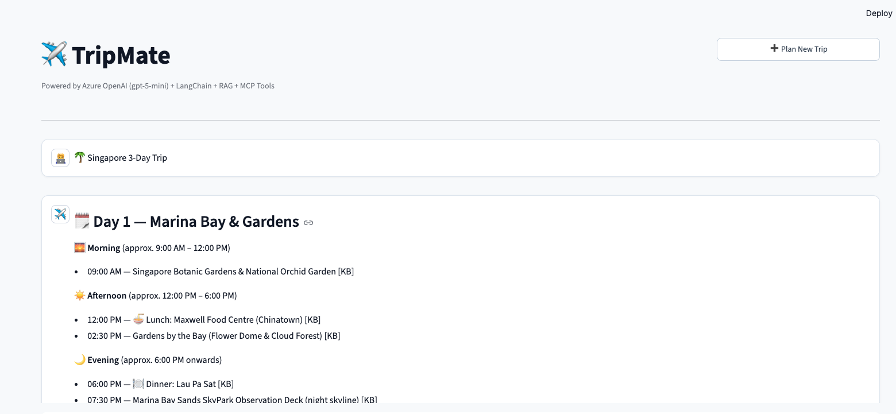
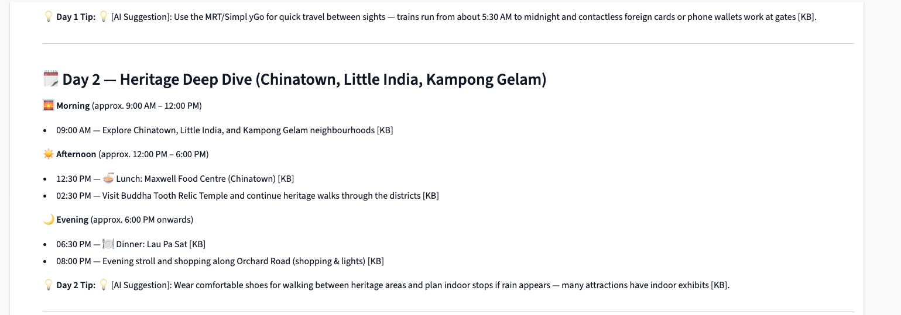
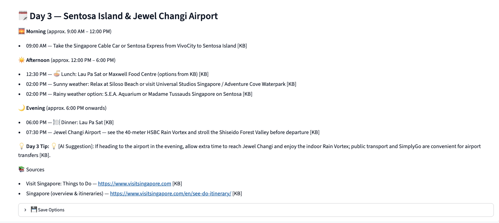
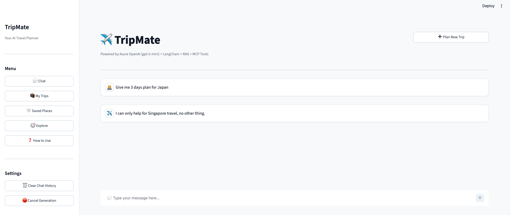
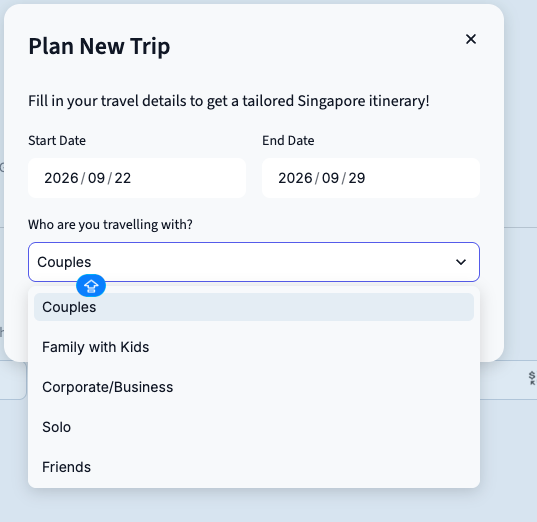
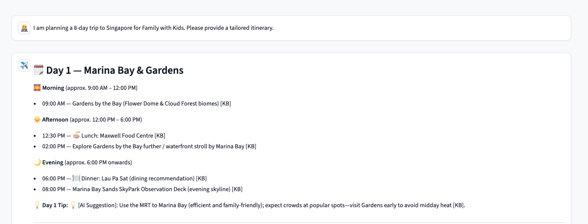

# ✈️ AI Travel Planning Assistant

A context-aware AI assistant for planning trips to **Singapore**, combining a document-based knowledge base with real-time data via MCP tools.

> **Assignment:** Developer Assignment — AI Travel Planning Assistant
> **Repository:** [https://github.com/satishf889/AI-TRAVEL-PLANNING-ASSISTANT.git](https://github.com/satishf889/AI-TRAVEL-PLANNING-ASSISTANT.git)
> **Destination:** Singapore
> **Stack:** Python 3.11 · LangChain · Azure OpenAI (gpt-5-mini) · ChromaDB · Streamlit · Docker

---

## Architecture

```
User Query
    │
    ▼
┌─────────────────────────────────────────────────────────┐
│                  Streamlit UI (features/ui/)             │
└────────────────────────┬────────────────────────────────┘
                         │
                         ▼
┌─────────────────────────────────────────────────────────┐
│          TravelAgent Orchestrator (features/orchestrator/)│
│  ┌─────────────────┐     ┌───────────────────────────┐  │
│  │  Intent         │     │  Context Manager          │  │
│  │  Classifier     │     │  (Multi-turn history)     │  │
│  └────────┬────────┘     └───────────────────────────┘  │
│           │                                               │
│    ┌──────┴──────┐                                        │
│    ▼             ▼                                        │
│  RAG Path    MCP Path                                     │
│    │             │                                        │
│    ▼             ▼                                        │
│ ┌──────┐   ┌──────────────┐                              │
│ │Chroma│   │ Weather Tool │  → Open-Meteo API (free)    │
│ │  DB  │   │ Currency Tool│  → Frankfurter API (free)   │
│ └──────┘   └──────────────┘                              │
│                                                           │
│           Azure OpenAI LLM (gpt-5-mini)                   │
└─────────────────────────────────────────────────────────┘
```

### Information Flow & Dual Response Attribution

Every response clearly distinguishes between **Knowledge Base [KB] Facts**, **Live MCP Data**, and **AI / LLM Suggestions**:

| User Question Type | Sources Used | Attribution & Tagging in Output |
|-------------------|-------------|----------------------------------|
| **Destination facts** (attractions, transport) | ChromaDB Vector Store (RAG) | `📚 Source: [Document Title](URL)` (Factual KB data only) |
| **Weather forecast** | Open-Meteo via MCP | `🌤️ Live data from Open-Meteo` |
| **Currency conversion** | Frankfurter via MCP | `💱 Live rate from Frankfurter` |
| **Combined** (itinerary + weather) | RAG + MCP + LLM | Combines KB facts (`📚`), MCP data (`🌤️`/`💱`), and AI synthesis (`💡 AI Suggestion`) |

---

## Tech Stack

| Layer | Technology |
|-------|-----------|
| Language | Python 3.11+ |
| UI | Streamlit |
| AI Orchestration | LangChain |
| LLM | Azure OpenAI (`gpt-5-mini`) |
| Embeddings | HuggingFace `sentence-transformers/all-MiniLM-L6-v2` (local, free) |
| Vector Store | ChromaDB (persisted to disk) |
| MCP Weather | Open-Meteo API (free, no key) |
| MCP Currency | Frankfurter Exchange Rates API (free, no key) |
| Testing | pytest + pytest-cov + pytest-mock |
| Containerization | Docker + Docker Compose |

---

## Knowledge Base Sources (Singapore)

The KB is built from these public resources (see `knowledge_base/`):

| File | Source | Coverage |
|------|--------|----------|
| `wikivoyage_singapore.md` | [Wikivoyage Singapore](https://en.wikivoyage.org/wiki/Singapore) | Districts, attractions, transport, food, itineraries |
| `visit_singapore_essentials.md` | [Visit Singapore: Essentials](https://www.visitsingapore.com/travel-guide-tips/practical-info/) | Climate, language, currency, connectivity |
| `visit_singapore_itineraries.md` | [Visit Singapore: Itineraries](https://www.visitsingapore.com/see-do-singapore/itineraries/) | 1/3/5-day sample itineraries |
| `visit_singapore_things_to_do.md` | [Visit Singapore: Things To Do](https://www.visitsingapore.com/see-do-singapore/) | Attractions, activities, family, culture |

> **License:** Wikivoyage content is CC BY-SA 4.0. Visit Singapore content — review their reuse terms at visitsingapore.com.

---

## RAG Workflow

```
knowledge_base/*.md
       │
       ▼ DocumentLoader (features/rag/document_loader.py)
Load + extract source metadata (title, URL)
       │
       ▼ DocumentChunker (features/rag/chunker.py)
Split into 1000-char chunks with 200-char overlap
       │
       ▼ Embedder (features/rag/embedder.py)
Generate embeddings with all-MiniLM-L6-v2 (local)
       │
       ▼ VectorStoreManager (features/rag/vector_store.py)
Persist to ChromaDB
       │
       ▼ KnowledgeRetriever (features/rag/retriever.py)
Retrieve top-5 chunks per query → formatted context + citations
```

---

## MCP Tools

### Tool 1: Weather (Open-Meteo)
- **No API key required**
- Endpoint: `api.open-meteo.com/v1/forecast`
- Returns: Daily max/min temp, precipitation, wind speed, WMO weather codes
- Rainy-day detection → `indoor_recommended` flag for itinerary planning

### Tool 2: Currency (Frankfurter)
- **No API key required**
- Endpoint: `api.frankfurter.app/latest`
- Returns: Live exchange rate + converted amount

---

## Prompt Strategy & Response Separation

> 📄 Full prompt templates in `features/orchestrator/prompt_templates.py`

The system prompts strictly enforce the separation between Knowledge Base [KB] facts and AI suggestions:
1. **Knowledge Base [KB] Facts** — Used exclusively for destination facts (attractions, transport, cultural tips), retrieved directly from vector storage and cited with exact metadata. Never fabricated.
2. **AI / LLM Suggestions (`💡 AI Suggestion`)** — Intelligent itinerary structuring, creative travel recommendations, and activity pacing generated by the LLM (Azure OpenAI).
3. **MCP Live Tools Data** — Real-time weather forecasts (`🌤️ Live data from Open-Meteo`) and currency conversions (`💱 Live rate from Frankfurter`).
4. **Scope Boundary Enforcement** — Out-of-scope requests (asking for itineraries outside Singapore) are explicitly declined without fabricating non-Singapore facts.
5. **Fallback Handling** — If KB content is insufficient or MCP tools are unavailable, the assistant clearly states the limitation rather than hallucinating answers.
6. **Context Retention** — User preferences (budget, duration, trip style) are preserved across multi-turn conversations.

---

## Project Structure

```
AI-TRAVEL-PLANNING-ASSISTANT/
├── .agents/AGENTS.md              # Agent rules (TDD, confirmation, module boundaries)
├── requirement-docs/
│   ├── AI_Travel_Planning_Assistant_Assignment.pdf
│   └── requirements.md            # Extracted requirements (agent-readable)
├── knowledge_base/                # Singapore KB documents (Markdown)
├── features/
│   ├── config/settings.py         # All settings via pydantic-settings
│   ├── rag/                       # RAG pipeline (loader → chunker → embedder → store → retriever)
│   ├── mcp/                       # MCP tools (weather, currency)
│   ├── orchestrator/              # LangChain agent + prompts + context manager
│   └── ui/                        # Streamlit app + components + session state
├── tests/                         # TDD test suite (mirrors features/ structure)
├── scripts/ingest_knowledge_base.py
├── .env.example                   # Environment variable template
├── Dockerfile
├── docker-compose.yml
├── requirements.txt
└── pyproject.toml                 # pytest + ruff + mypy config
```

---

## Setup & Evaluator Guide

### Prerequisites
- **Python 3.11+** or **Docker & Docker Compose**
- **Azure OpenAI Credentials**: API Key and Endpoint URL with `gpt-5-mini` (or standard GPT-4o model deployment).

---

### Step 1: Environment Configuration

Clone the repository, copy the environment template, and set your Azure OpenAI API keys:

```bash
git clone https://github.com/satishf889/AI-TRAVEL-PLANNING-ASSISTANT.git
cd AI-TRAVEL-PLANNING-ASSISTANT
cp .env.example .env
```

Open `.env` and fill in the required Azure OpenAI values:
```ini
AZURE_OPENAI_API_KEY=your_azure_openai_api_key_here
AZURE_OPENAI_ENDPOINT=https://your-resource-name.openai.azure.com/
AZURE_OPENAI_DEPLOYMENT_NAME=gpt-5-mini
AZURE_OPENAI_API_VERSION=2024-08-01-preview
```

---

### Step 2: Running the Application

Choose **Option A (Docker)** or **Option B (Local Virtual Environment)**:

#### Option A: Running with Docker (Recommended)

1. **Build and Start All Services**:
   ```bash
   docker-compose up --build
   ```
2. **Access the Application**:
   Open your browser at `http://localhost:8501`.

#### Option B: Running Locally (Python `.venv`)

1. **Create and Activate Virtual Environment**:
   ```bash
   python3 -m venv .venv
   source .venv/bin/activate  # On macOS/Linux
   ```
2. **Install Dependencies**:
   ```bash
   pip install -r requirements.txt
   ```
3. **Ingest Knowledge Base into ChromaDB**:
   ```bash
   python scripts/ingest_knowledge_base.py
   ```
   *Output should indicate: `Ingestion complete! ✅ (48 vectors stored in ChromaDB)`*

4. **Launch Streamlit Web UI**:
   ```bash
   streamlit run features/ui/app.py
   ```
   *Open your browser at `http://localhost:8501`.*

---

### Step 3: Running Automated Unit & Integration Tests

To run the complete test suite with coverage report:

```bash
# Using local virtual environment
pytest tests/ -v

# Or using Docker
docker-compose run --rm app pytest tests/ -v
```

---

## 🧪 Evaluator Verification Checklist & Sample Queries

Try these sample queries in the Streamlit UI (`http://localhost:8501`) to evaluate each requirement:

| Evaluation Criteria | Test Query | What to Verify |
|---------------------|------------|----------------|
| **1. Destination Knowledge (RAG)** | *"What are the top attractions to visit in Singapore?"* | Grounded response with document citations (e.g. `📚 Source: ...`) |
| **2. Public Transport (RAG)** | *"How does public transport work in Singapore?"* | Fact-checked transport guide sourced from knowledge base metadata |
| **3. Live Weather Forecast (MCP)** | *"What is the weather forecast for Singapore this week?"* | Response explicitly marked with `🌤️ Live data from Open-Meteo` |
| **4. Live Currency Conversion (MCP)** | *"Convert 500 USD to SGD"* | Real-time rate conversion labeled with `💱 Live rate from Frankfurter` |
| **5. Combined RAG + MCP (Mandatory)** | *"Create a 3-day Singapore itinerary for next week and adjust activities based on the weather forecast."* | Combines KB attractions with live weather forecast to recommend outdoor/indoor activities |
| **6. Budget + Currency + Itinerary** | *"I have a budget of INR 50,000. Convert to SGD and suggest a 3-day plan."* | Performs currency conversion via MCP, converts budget to SGD, and builds itinerary via RAG |
| **7. Multi-turn Context** | *Follow-up:* *"What indoor options are nearby for Day 2?"* | Retains context from previous turn (preserves destination, duration, budget preferences) |

---

## 🖼️ Application Interface Snapshots

Below are actual UI snapshots of the Streamlit application demonstrating each core feature in exact sequence:

### 1. Destination Knowledge Assistant (RAG)
Shows grounded responses sourced from the travel knowledge base with document citations.



---

### 2. Live Travel Information (MCP Tools)
Shows live weather forecasts from Open-Meteo and real-time currency conversions from Frankfurter.



---

### 3. Combined RAG + MCP Weather-Aware Itinerary & Multi-Turn Context
Shows a weather-adjusted 3-day Singapore itinerary combining knowledge base facts, live weather forecast, currency conversion, and multi-turn context retention.



---

### 4. Out-of-Scope Request Handling (Non-Singapore Destination Queries)
Shows the assistant handling out-of-scope requests when anything other than a Singapore travel itinerary is asked. The system prompt rules strictly enforce scope boundaries, declining to fabricate facts for unsupported destinations and refocusing the user on Singapore planning.



---

### 5. Interactive "Plan My Trip" Configuration Form
The **"Plan My Trip"** button opens an interactive trip planning wizard in the Streamlit UI. It allows users to set their travel dates, trip duration, travel group type (solo, couple, family, friends), travel style preferences (cultural, adventure, relaxation, foodie), and budget limits.



---

### 6. Customized Itinerary Output & Saved Trips Management
When the user submits the **"Plan My Trip"** form, the assistant automatically triggers the AI orchestrator to generate a comprehensive, day-by-day Singapore itinerary. The generated plan embeds Knowledge Base facts (`📚`), adjusts for live weather forecasts (`🌤️`), converts budget amounts (`💱`), and includes interactive **Save Options** (`💾`) to bookmark itineraries in **My Trips** or places in **Saved Places**.



---

## Minimum Acceptance Criteria Status

- [x] Knowledge base from ≥ 3 travel resources
- [x] Embedding-based semantic retrieval
- [x] Grounded answers with source references
- [x] Weather information via MCP tool
- [x] Currency conversion via MCP tool
- [x] Combined RAG + MCP response (weather-aware itinerary)
- [x] Multi-turn conversation with context retention
- [x] Appropriate tool selection based on user intent
- [x] Clear handling of missing KB / tool failures
- [x] Simple, usable Streamlit interface